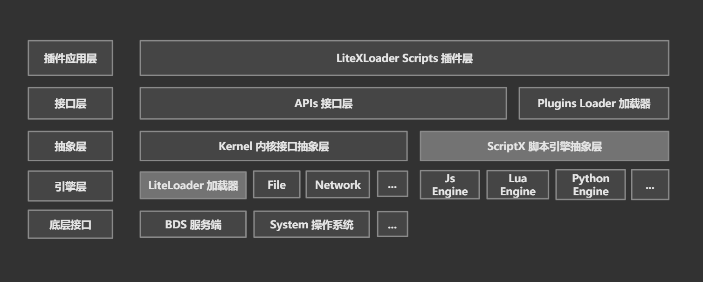

# LiteXLoader - 项目维护与支持文档

[<< 返回起始页](../../)

## ⛳  欢迎！

也许，你使用LXL开发插件已久，作为一个经验丰富的开发者，对LXL本身项目的发展有自己的想法；  
也许，你是一个刚刚接触LXL的大佬，对它的功能和架构很有兴趣，想进行研究；  
也许，你是一个经验丰富的老腐竹，想帮助LXL项目更好的发展，为自己的服务器插件添砖加瓦；  
也许，  。。。。

在这里欢迎每一位有意参与LiteXLoader项目维护的开发者和贡献者！  
没有你们的付出，LXL将失掉很多的活力和创新。

下面将是对项目架构的简析和维护项目、贡献代码的相关说明。希望可以从中得到你想要的信息。

<br>

## 👓 项目架构分析

> `LiteXLoader`是一个基岩版官方服务端`Bedrock Delicated Server`（以下简称**BDS**）插件框架，提供强大的跨语言脚本插件支持能力和稳定的开发API支持。

正如项目介绍所言，LXL一个拥有跨语言、跨平台能力的BDS服务端插件框架。

### 跨语言开发能力

LXL开发之初的想法，便是依靠跨语言引擎的支持，整合多种脚本语言，并给予统一的开发接口，解决相关开发生态破碎的问题。  
实际项目中，使用腾讯开源项目`ScriptX`的跨语言引擎，在对接多种后端的同时，ScriptX导出了统一的C++接口。  
因此，LXL在对接BDS时仅维护了1套底层接口，和脚本引擎的对接相当方便。  
目前，`ScriptX`仍在发展之中，新的语言支持还需时日，让我们拭目以待。

<br>

### 模块化，兼容性

LXL最重要的思想，就是将各重要功能模块化，方便于后续的维护和子项目的升级。基于模块化的设计思想，LXL将底层加载器接口、多种脚本引擎后端、插件加载模块互相分离，保证各个部分可以单独维护升级，各模块之间尽量降低耦合度，方便进行修改和功能新增。

`LiteXLoader`的架构，可以从此图一眼看出：



- `LiteLoader`加载器和`ScriptX`两部分提供重要的基础接口
- Kernel内核抽象层负责所有对`LiteLoader`API的调用、Hook函数调用以及对其他底层库函数的调用，并将他们各自的类型抽象为标准的变量类型和STL容器，将各自的接口封装，避免对底层项目的强依赖扩散到上层。
- API接口层为ScriptX脚本引擎提供API接口，引擎将API注入到脚本系统中，在脚本中即是调用相关的API接口完成和BDS的交互
- ScriptX完成对下层脚本引擎的统一抽象，在上层提供一致的接口，为跨语言脚本开发提供基础

同时，由于使用C/C++语言开发，`LiteLoader`+`LiteXLoader`的加载器组合在Linux上同样可以使用 **Wine** 来支持运行，各功能仍能正常工作，且运行性能显著高于Linux原版BDS。使用Linux的开发者们，不用担心平台兼容性的问题。

<br>

### 开源项目目录结构介绍

项目使用cmake构建系统构建。  
上述的架构落实到实际项目中，项目目录结构如图所示：

```
├───build			- 构建脚本所在地
├───engine			- 各脚本引擎的头文件和静态库
│   ├───Lua
│   └───V8
├───libs			- 底层加载器库
│   └───LiteLoader
├───LiteXLoader.Js		- 构建中间目录，cmake在里面 
├───LiteXLoader.Lua		- 构建中间目录，cmake在里面 
├───Release			- 构建最终产物目录，包括DLL和各依赖库
│   ├───RuntimesLibs		- 脚本引擎依赖库 
│   │   └───Js
│   └───ScriptBaseLibs		- LXL脚本基础库
├───src				- LXL源码目录
│   ├───API			- APIs接口层
│   ├───Kernel			- Kernel内核抽象层
│   ├───LiteLoader		- 底层加载器头文件
│   │   └───headers
│   ├───Minini			- 第三方ini解析库
│   ├───Nlohmann		- 第三方json解析库
│   └───ScriptX			- ScriptX项目目录
└───test
```

<br>

### 相关底层原理

关于如何从BDS获取底层接口，BDS各大插件框架的方法都大同小异：使用Hook。这里会涉及到很多Windows操作系统底层相关的知识，这也就是为什么BDS的C++插件很难开发的原因之一。  

Hook技术，指的并不是Win中SetWindowsHookEx那一套的钩子系统，而是借由那套系统的机制做类比：在BDS由于某个事件发生，在执行某个函数的时候，通过一些方式让其转而先执行一些我们自己的代码，再返回到BDS执行它原本要执行的东西。这样一来，就完成了我们自己的代码对BDS函数的所谓**Hook**。  

在我们自己的代码中，可以针对这个事件做一些响应，比如说调用一些其他的BDS函数，或者记录到数据库，甚至是拦截这个函数不让BDS继续执行，以达到阻止这个事件发生的目的......总而言之，就是通过Hook给代码加入了开发者自己的逻辑，来实现一些原版服务器所无法实现的行为。

<br>

## 🎯 维护项目和贡献代码

由于Mojang每次更新BDS时候都会修改代码，导致部分使用Hook机制的底层API失效，因此，加载器也需要跟随版本更新不断进行维护，否则很多功能会逐渐失去效用。

由于相关维护需要较强的技术能力，这方面的社区人才一直处于较为匮乏的状态。  
因此，如果你有兴趣参与项目的维护和贡献代码，我们绝对非常欢迎

<br>

### 如果您。。。

####  C++ 开发技术相对欠缺，但我希望对项目做出贡献

- 你可以积极为LXL开发插件，这对LXL的生态建设可以说是莫大的帮助
- 你可以帮助修改和优化开发文档，提出你想要的API并推送给作者，给大家一些改进的点子
- 你可以帮助宣传和推广LXL，让更多的人参与到这个项目中来，也可以帮萌新们答疑解惑

#### 有一定的 C++ / 脚本开发能力，使用过 / 有兴趣学习如何使用 ScriptX 跨语言脚本引擎

- 你可以维护LXL抽象层上面的接口层API，修复某些问题，提出改进
- 你可以帮忙为LXL实现更多的基础设施，类似于完整的网络库、完整的json解析系统等等
- 你可以帮助我们把LXL的上层建筑（类，接口等）做得更好

#### 有较强的 C++ 开发能力，对底层技术有一定掌握，但不太掌握 ScriptX 引擎相关技术

- 你可以帮助维护Kernel抽象层中重要的Hook符号，并在发现问题时提出解决方案
- 你可以帮忙使用IDA解析pdb符号数据库，从中发现新的可用的事件点和API函数
- 你可以对我们的底层机制提出改进的意见，帮助我们将好的想法付诸实践

#### 底层开发大佬 / 算法竞赛大神 / 逆向奇才 / 工作经验丰富的开发者

- 你可以深度参与项目各方面开发和推进，帮助优化LXL和LiteLoader的代码，对架构进行改进甚至翻新
- 你可以帮忙改进相关底层机制，提高运行效率，也可以贡献代码改进关键部分的算法
- 你可以为LXL未来的发展提出你的思考和想法，为未来做个引路者

<br>

当然，更欢迎各位向`LiteLoader`项目和`ScriptX`项目做出贡献。他们是LiteXLoader赖以发展的重要支持。  
只要你愿意，开源社区的大门将永远向你敞开！

<br>

### 具体维护方法举例

按照当前的程序架构和代码排布，针对特定的一些维护需求，为大家指明方向

#### 维护

<br>

## 放在最后

开源社区的建设，必然是一个细水长流，逐渐发展的过程。BDS插件开发圈才处在刚刚成长起来的阶段，各方面都有一些不足，也希望大家都可以多多谅解。

不知不觉地，MC也已经陪伴我们走过了十二三个年头。这款在推出不久就火遍全球，至今仍然称霸一方的游戏，究竟为何如此吸引我们的目光？很简单：自由世界，拓展性强，这是Minecraft精神最为核心的部分之一。如今，Java版MC的生态可以说是完善而自由了，而基岩却相对要缺乏得多，这其中，固然有各种因素的存在，而在我看来，一个完善和活跃的社区生态在其中起到了非常关键的作用。在发展的时间与经历和JE无法相比的情况之下，有没有什么办法可以重现JE多年以前那个时代的荣光？很简单，机会现在就掌握在你的手里。

《孟子》有云： *故天将降大任于是人也，必先苦其心志，劳其筋骨，饿其体肤，空乏其身，行拂乱其所为，所以动心忍性，曾益其所不能* 。确实，如今，我们是在探索一条之前没有多少人走过的道路。面对如今的重重挑战，你有想法，有信心来面对问题，来帮助我们创造一个更好的世界吗？

跟我们来吧！

⭐

[点击此处](https://github.com/LiteLDev/LiteXLoader) 前往LiteXLoader项目源码开源地址

[<< 返回起始页](../../)